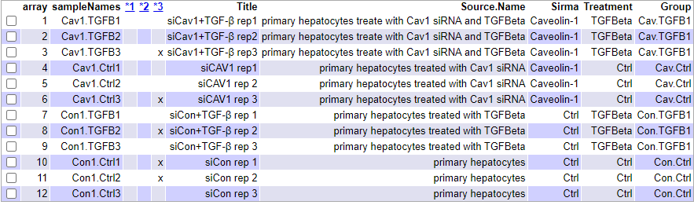

```{r setup, include=FALSE}
require(knitr)
knitr::opts_chunk$set(echo = TRUE, message = FALSE, warning = FALSE, 
                      comment = NA, prompt = TRUE, tidy = FALSE, 
                      fig.width = 7, fig.height = 7, fig_caption = TRUE,
                      cache=FALSE)
Sys.setlocale("LC_TIME", "C")
```

```{r echo=FALSE}
if(!(require(printr))) {
  install.packages(
    'printr',
    type = 'source',
    repos = c('http://yihui.name/xran', 'http://cran.rstudio.com')
  )
}
```


#  Abstract

El presente documento trata de un análisis completo de microarrays mediante paquetes de R y Bioconductor, el protocolo de actuación comenzará con los datos sin procesar, pasando por la lectura de éstos datos, comprobación de la calidad, normalización, filtrado, selección de genes diferencialmente expresados, comparación de listas seleccionadas y el análisis de la significacion biológica. 

# Palabras clave

Bioconductor, R, Microarrays, Expresión diferencial


# 2. Materiales

## 2.1 Software

## 2.2 Datos

# 3. Métodos

## 3.1 Preparación del entorno de trabajo


##3.3.Procedimiento 
Para analizar los datos apropiadamente, crearemos un directorio de trabajo llamado "Pec1,


```{r CreateFolders,warning=FALSE,eval=FALSE}
setwd(".")
dir.create("data")
dir.create("results")
dir.create("figures")
```
## 3.2 Preparación de los datos para el análisis

Los datos para el análisis constan de dos tipos de archivo, los archivos "CEL"(en nuestro caso 12 archivos .CEL que hemos descargado), y un archivo "targets.xlsx" que posteriormente convertimos a "targets.csv". Los archivos "CEL" son los datos sin procesar originados después de escanear y preprocesar el microarray con el software Affymetrix. Los archivos mencionados los almacenaremos en la carpeta "data". El archivo "targets" contiene la información sobre grupos y covariables, relaciona el nombre de cada archivo .CEL con su condición en el experimento. 


Para el análisis el archivo targets ha sido guardado con formato .csv, hemos creado el archivo a raíz de la información obtenida en (https://www.ncbi.nlm.nih.gov/geo/query/acc.cgi?acc=GSE137339). La tabla 1 muestra el contenido del archivo "targets" utilizado en el presente análisis:

```{r ReadTargets}
targets <- read.csv2("./data/targets.csv", header = TRUE, sep = ";") 
knitr::kable(
  targets,booktabs=TRUE,
  caption='Tabla 1. Contenido del fichero targets utilizados para el análisis'
)
```
## 3.3 Instalación de paquetes en R

Los paquetes no disponibles en la instalación básica de R deben instalarse antes de proceder con el análisis. Los paquetes necesarios para realizar el estudio se pueden descargar de distintos repositorios, los más comunes serán CRAN para paquetes estándar o Bioconductor. Los paquetes r estándar se pueden descargar e instalar repositorios predeterminados de formulario con la función install.packages.  Los envases de bioconductor se pueden descargar e instalar con la función  biocLite() que en su momento se puede cargar en R con la fuente de instrucciones("https://bioconductor.org/biocLite.R").  
El siguiente código descargará e instalará los paquetes necesarios para el análisis. Éste código debe ejecutarse solo una vez. Las ejecuciones posteriores del análisis no necesitan volver a instalar los paquetes:
```{r , include=FALSE}

chooseCRANmirror(graphics=FALSE, ind=1)

install.packages("knitr")
install.packages("gplots")

if (!requireNamespace("BiocManager", quietly = TRUE))
    install.packages("BiocManager")

BiocManager::install("Biobase")
BiocManager::install("arrayQualityMetrics")
BiocManager::install("affy")
BiocManager::install("oligo")
BiocManager::install("oligoClasses")
BiocManager::install("pd.mogene.1.0.st.v1")
BiocManager::install("mogene10sttranscriptcluster.db")
BiocManager::install("genefilter")
BiocManager::install("limma")
BiocManager::install("GEOquery")
BiocManager::install("annotate")
BiocManager::install("AnnotationDbi")
BiocManager::install("org.Mm.eg.db")
BiocManager::install("ReactomePA")
BiocManager::install("reactome.db")
BiocManager::install("affycoretools")

```
```{r, include=FALSE}
library(knitr)
library(kableExtra)
library(Biobase)
library(arrayQualityMetrics)
library(affy)
library(Biobase)
library(BiocManager)
library(oligoClasses)
library(oligo)
library(pd.mogene.1.0.st.v1)
library(mogene10sttranscriptcluster.db)
library(genefilter)
library(limma)
library(GEOquery)
library(annotate)
library(AnnotationDbi)
library(gplots)
library(org.Mm.eg.db)
library(ReactomePA)
library(reactome.db)
```

## 3.4. Lectura de los archivos CEL

El siguiente paso es leer los datos sin procesar (archivos .CEL) y almacenar los datos en una variable (en este caso lo hemos llamado rawData). Primero tenemos que cargar el paquete  oligo con la bibliotecade funciones.  En este paquete se codifican las funciones para leer los archivos CEL. Tenga en cuenta la opción para colocar la carpeta correcta donde se guardan los archivos CEL al ejecutar la función list.celfiles.
Procederemos a continuación a leer los ficheros .CEL (raw data), generamos una nueva variable "rawData":

```{r ReadCELfiles, message=FALSE, results='hide', warning=FALSE}
require(oligo)
celFiles <- list.celfiles("./data", full.names = TRUE)
require(Biobase)
my.targets <-read.AnnotatedDataFrame(file.path("./data","targets.csv"), 
                                     header = TRUE, row.names = 1, 
                                     sep=";") 
rawData <- read.celfiles(celFiles, phenoData = my.targets)
```
Para facilitar nuestro trabajo, cambiaremos el nombre largo por las abreviaturas asignadas (ShortName):
```{r ChangeName}
colnames(rawData) <-rownames(pData(rawData)) <- my.targets@data$ShortName
```
###3.5.Control de calidad de los datos sin procesar

Empleamos la libreria "arrayQualityMetrics()" para realizar el control de calidad de los raw data. Comprobamos los resultados del análisis de calidad en una carpeta QCDIR.raw creada dntro de la carpeta de resultado creada anteriormente. Dentro de ésta carpeta buscaremos un archivo llamado index.html, que abre una página web desde donde podremos acceder a un resumen del análisis realizado. La imágen de la figura 3 muestra el encabezado de éste archivo que contiene una tabla con tres columnas que indican algunos criterios de calidad que deben ser verificados. Se han marcado 5 muestras, generlamente si sólo hay una marca significa que los problemas potenciales que pueden acarrear son pequeños, por lo que podemos decidir mantener todas las matrices en el análisis. 

```{r QCRaw, message=FALSE, warning=FALSE, eval=FALSE}
## indicamos que se genere un nuevo directorio dentro de la carpeta "results" llamado "QCDIR.raw"
require(arrayQualityMetrics)
arrayQualityMetrics(rawData, outdir = file.path("./results", "QCDir.Raw"), force=TRUE)
```

```{r QCRawDataRes, fig.cap="Figura 1. Resumen del control de calidad de los datos crudos producido por arrayQualityMetrics()", echo=FALSE}

```


Realizaremos otro análisis de calidad, el análisis de componentes principales (PCA Analysis)
```{r}
library(ggplot2)
library(ggrepel)
plotPCA3 <- function (datos, labels, factor, title, scale,colores, size = 1.5, glineas = 0.25) {
  data <- prcomp(t(datos),scale=scale)
  # plot adjustments
  dataDf <- data.frame(data$x)
  Group <- factor
  loads <- round(data$sdev^2/sum(data$sdev^2)*100,1)
  # main plot
  p1 <- ggplot(dataDf,aes(x=PC1, y=PC2)) +
    theme_classic() +
    geom_hline(yintercept = 0, color = "gray70") +
    geom_vline(xintercept = 0, color = "gray70") +
    geom_point(aes(color = Group), alpha = 0.55, size = 3) +
    coord_cartesian(xlim = c(min(data$x[,1])-5,max(data$x[,1])+5)) +
    scale_fill_discrete(name = "Group")
  # avoiding labels superposition
  p1 + geom_text_repel(aes(y = PC2 + 0.25, label = labels),segment.size = 0.25, size = size) + 
    labs(x = c(paste("PC1",loads[1],"%")),y=c(paste("PC2",loads[2],"%"))) +  
    ggtitle(paste("Principal Component Analysis for: ",title,sep=" "))+ 
    theme(plot.title = element_text(hjust = 0.5)) +
    scale_color_manual(values=colores)
  }
```

```{r PCARaw, message=FALSE, fig.cap="Figura 2.Visualización de los componentes principales de los raw data "}
plotPCA3(exprs(rawData), labels = targets$ShortName, factor = targets$Group, 
         title="Raw data", scale = FALSE, size = 3, 
         colores = c("red", "blue", "green", "yellow"))
```
El primer componente del PCA abarca un total del 49.3% de la variabilidad de las muestras,y el segundo abarca un 25.2%. Podemos deducir que la variabilidad está condicionada al tipo de tratamiento (si está tratada con TGFB). Con el siguiente código guardaremos los gráficos en un archivo "tiff":
```{r savePCAraw, echo=TRUE, results='hide'}
tiff("figures/PCA_RawData.tiff", res = 200, width = 4.5, height = 4, units = 'in')
plotPCA3(exprs(rawData), labels = targets$ShortName, factor = targets$Group, 
         title="Raw data", scale = FALSE, size = 2, 
         colores = c("red", "blue", "green", "yellow"))
dev.off()
```
Realizamos una figura de la distribuión de las intensidades mediante un "boxplot":
```{r BoxplotRaw, message=FALSE, fig.cap="Figura 2. Boxplot de las raw data"}
boxplot(rawData, cex.axis=0.5, las=2,  which="all", 
         col = c(rep("red", 3), rep("blue", 3), rep("green", 3), rep("yellow", 3)),
         main="Distribution of raw intensity values")
```
Se observa una ligera variación de intensidad entre arrays, pero es lo esperado para los datos sin procesar, Cada color representa a un grupo de datos


```{r saveIntensRaw, echo=FALSE, results='hide'}
tiff("figures/figura3.tiff", res = 200, width = 4, height = 4, units = 'in')
boxplot(rawData, cex.axis=0.5, las=2,  which="all", 
         col = c(rep("red", 3), rep("blue", 3), rep("green", 3), rep("yellow", 3)),
         main="Distribution de la intensidad de las raw data")
dev.off()
```
Se observa una ligera variación en la intensidad en los arrays, que es la esperada para unos datos en crudo o raw data. 

## 3.7. Normalización de los datos

Antes de emprender el análisis de la expresión diferencial, necesitamos optimizar los arrays y que sean comparables entre ellos, reduciendo y si es posible eliminando, toda la variabilidad den las muestras que no son debidas a razones biológicas. Queremos pues, asegurarnos que las diferencias son debidas a la expresión diferencial de los genes y no a sesgos artificiales debidos a problemas técnicos. 
```{r Normalization}
eset_rma<-oligo::rma(rawData)
eset_rma
##Es necesario guardar los datos normalizados en un fichero .csv
write.csv2(exprs(eset_rma), file="./results/normalized.Data.csv")
```
Volvemos a realizar un control de los datos normalizados para compararlos con los rawdata
```{r QCNorm,message=FALSE,warning=FALSE,eval=FALSE}

library(arrayQualityMetrics)
arrayQualityMetrics(eset_rma,outdir=file.path("./results,QCDir.Norm"))

```
Los resultados obtenidos de arrayQualityMetrics nos muestrasn una notable mejora de los indicadores

```{r control de calidad de datos normalizados resultados, out.width="50%", fig.align="center", fig.cap="Resumen de resultados del fichero index.html para el análisis por arrayQualityMetrics de los datos normalizados"}
knitr::include_graphics("figures/figura6.png")
```
La figura 6 muestra el mismo resumen que el mostrado anteriormente, pero se realiza con datos normalizados. Obsérvese que ya no hay ninguna columna marcada.

Realizamos un gráfico del análisis de los componentes principales realizados en datos normalizados:

```{r PCANorm,message=FALSE,fig.cap="Visualization of first two principal components for normalized data"}
plotPCA3(exprs(eset_rma), label = targets$ShortName, factor = targets$Group, 
         title="Datos normalizados", scale = FALSE, size = 2 , 
         colores = c("red", "blue","green","yellow"))
```
En la figura 7 vemos que  el primer componente representa el 57.5% de la variabilidad total, el porcentaje de variabilidad explicada ha aumentado con respecto al análisis anterior en datos sin procesar. Del mismo modo que con el PCA con datos sin procesar, separa las muestra de la condición sin TGFB1 a la derecha y las muestras tratadas con TGFB1 a la izquierda. 


```{r BoxplotNorm, message=FALSE,fig.cap="Distribution of intensities for narmalized data"}

boxplotnormalizado <- boxplot(eset_rma, cex.axis=0.5, las=2,  which="all", 
         col = c(rep("red",3), rep("blue",3),rep("green",3),rep("yellow",3)),
         main="Boxplot for arrays intensity: Normalized Data")
```
La figura 8 se observa una gráfica boxplot que representa la distribución de las intensidades normalizadas a lo largo de todas las muestras, sugiere que la normalización ha funcionado bien. 

## 3.8 Análisis de batch

Los resultados de los microarrays de expresión génica pueden verse afectados por diferencias minúsculas en cualquier número de variables no biológicas como reactivos de diferentes lotes, la manipulación de técnicos diferentes y la más habitual que es la diferente fecha de procesamiento de las muestras del mismo experimento. El error acumulativo introducido por éstas variaciones experimentales se conoce como "efectos por lotes" o "batch effect". Se han desarrolado diferentes enfoques para identificar y eliminar los efectos por lostes de los datos de microarrays,utilizaremos el análisis PVCA (análisis de variación principal):

Batch detection

```{r BatchDetection, message=FALSE, warning=FALSE}
#load the library
require(pvca)
pData(eset_rma) <- targets
#select the threshold
pct_threshold <- 0.6
#select the factors to analyze
batch.factors <- c("Treatment", "Group")
#run the analysis
pvcaObj<-pvcaBatchAssess(eset_rma,batch.factors,pct_threshold)
```

```{r}
bp <- barplot(pvcaObj$dat, xlab = "Efectos",
 ylab = "Variació de la proporció mitjana ponderada",
 ylim= c(0,1.1),col = c("mediumorchid"), las=2,
 main="Estimació PVCA")
axis(1, at = bp, labels = pvcaObj$label, cex.axis = 0.75, las=2)
values = pvcaObj$dat
new_values = round(values , 3)
text(bp,pvcaObj$dat,labels = new_values, pos=3, cex = 0.7)
```
Los resultados muestras que la principal variación es debida al tratamiento al cual están sometidas las muestras, es un factor experimental incorporado en el análisis, por lo tanto se espera que suponga una variación significativa. Podemos descartar pues fuentes de variación debidas a aspectos metodológicos del experimento. 

## 3.9. Detección de los genes más variables
La selección diferencial de genes expresados se ve afectada por el número de genes a analizar. Cuanto mayor sea el número mayor será el ajuste necesario de los p valores. Si un gen se expresa diferencialmente, se espera que haya una cierta diferencia entre grupos, por lo tanto la varianza global del gen será mayor que la de aquellos que no tienen expresión diferencial. Trazar la variabilidad general de todos los genes es útil para decidir qué porcentaje de genes muestran una variabilidad que puede atribuirse a otras causas que no sean la variabilidad aleatoria. En la figura 10 se representan las desviaciones estándar de todos los genes ordenados de más pequeño a más grande, la gráfica muestra que los genes más variables son aquellos con una desviación estándar por encima del 90-95%:

```{r SDplot, fig.cap="Values of standard deviations allong all samples for all genes ordered from smallest to biggest"}
sds <- apply (exprs(eset_rma), 1, sd)
sdsO<- sort(sds)
plot(1:length(sdsO), sdsO, main="Distribution of variability for all genes",
     sub="Vertical lines represent 90% and 95% percentiles",
     xlab="Gene index (from least to most variable)", ylab="Standard deviation")
abline(v=length(sds)*c(0.9,0.95))
```
## 3.10. Filtrado de genes

Pretendemos filtrar aquellos genes cuya variabilidad puede atribuirse a una variación aletaroia, es decir, aquellos genes que, razonablemente no se espera que se expresen diferencialmente. La función nsFilter del paquete bioconductor se puede utilizar para eliminar genes basados en un umbral de variabilidad:

```{r Filtering1, results='hide', message=FALSE}
require(genefilter)
require(mogene10sttranscriptcluster.db)
annotation(eset_rma) <- "mogene10sttranscriptcluster.db"
filtered <- nsFilter(eset_rma, 
                     require.entrez = TRUE, remove.dupEntrez = TRUE,
                     var.filter=TRUE, var.func=IQR, var.cutoff=0.75, 
                     filterByQuantile=TRUE, feature.exclude = "^AFFX")
```

```{r FilterResults1, results='hide', echo=FALSE}
names(filtered)
class(filtered$eset)
```

```{r FilterResults2}
print(filtered$filter.log)
eset_filtered <-filtered$eset
```

## 3.11. Guardado de los datos normalizados y filtrados

```{r SaveData1, results='hide', message=FALSE}
write.csv(exprs(eset_rma), file="./results/normalized.Data.csv")
write.csv(exprs(eset_filtered), file="./results/normalized.Filtered.Data.csv")
save(eset_rma, eset_filtered, file="./results/normalized.Data.Rda")
```
La función nsFilter devuelve los valores filtrados y un informe de los resultados del filtrado. Los datos filtrados son el punto de partida para análisis posteriores, pero es posible que deseemos volver a ellos, por ejemplo para revisar valores específicos de expresión génica. ç

## 3.12 Definición de la matriz de diseño

La selección de genes diferenciales expresados consiste en hacer alguna prueba, generalmente de carácter genético para comprobar la expresión entre grupos. El protocolo que utilizaremos será el método de los modelos lineales para microarrays, implementado en el paquete de limma para seleccionar genes expresados de forma diferencial.

El primer paso para el análisis basado en modelos lineales es crear la matriz de diseño, básicamente es una matriz que descirbe la asignación de cada muestra a un grupo o condición experimenta. Tiene tantas filas cmo muestras y tantas columnas como grupos. La matriz de diseño se puede definir de manera manueal oa a aprtir de una variable de factor que puede haber sido introducida en el archivo "targets". En nuestro estudio, la variable "Grupo" es una combinación de las condiciones experimentales "Caveolina/TGFB" y "Control/TGFB", que representaremos conjuntamente como un factor con cuatro niveles:
```{r DesignMatrix, message=FALSE}
library(limma)
designMat<- model.matrix(~0+Group, pData(eset_filtered))
colnames(designMat) <- c("Cav.TGFB1", "Cav.Ctrl", "Con.TGFB1", "Con.Ctrl")
print(designMat)
```
Definiremos la matriz de contraste escribiendo las comparaciones entre grupos, la matriz debe constar de tantas columnas como comparaciones -tres en nuestro comparaciones en nuestro caso- y tantas filas como grupos -cuatro en nuestro caso-.Las comparaciones a realizar se basan en :
1. Caso CAV:si existen diferencias entre los hepatocitos caveolina/TGFB y caveolina/no TGFB
2. Caso CON: el segundo caso si hay diferencias entre los hepatocitos control/TGFB y control/no TGFB
3. Caso INT: en el tercer caso una comparación entre el caso CAV y el caso CON

## 3.13 Definición de la matriz de contrastes

La matriz de contrastes se utiliza para describir las comparaciones entre gurpos. Se compone de tantas columnas como comparaciones y tantas filas como grupos. Una comparación entre grupos -llamado "contraste"- se representa mediante un "1" y un "-1" en las filas de grupos para comparar y ceros en el resto. Si varios grupos intervinieran en la comparación tendrían tantos coeficientes como grupos con la única restricción de que su suma sería zero. 
```{r setContrasts}

cont.matrix <- makeContrasts (CAV = Cav.TGFB1-Cav.Ctrl,
                              CON = Con.TGFB1-Con.Ctrl,
                              INT = (Cav.TGFB1-Cav.Ctrl) - (Con.TGFB1-Con.Ctrl),
                              levels=designMat)
print(cont.matrix)
```

## 3.14. Estimación del modelo y selección de genes

Una vez definida la matriz de diseño y los contrastes, procederemos a estimar el modelo, estimar los contrastes y realizar las purebas de significación que conducirán ala decisión, para cada gen y cada comparación, si pueden considerarse diferencialmente expresados. 
```{r, linearmodelfit}
require(limma)
fit<-lmFit(eset_filtered, designMat)
fit.main<-contrasts.fit(fit, cont.matrix)
fit.main<-eBayes(fit.main)
class(fit.main)
results<-decideTests(fit.main)

class(fit.main)
```
## 3.15. Obtención de una lista de genes expresados diferencialmente

La función topTable() contiene, para un contraste dado, una lista de genes ordenados desde aquel con el valor p más pequeño hasta el más grande, que podemos considerar de menos a más difrencialmente expresado. Procederemos con las tres comparaciones:

Comparación 1: Genes que cambian su expresión dentro del grupo con caveolina si son tratados o no con TGFB
```{r, topTabs1}
topTab_CAV<- topTable (fit.main, number=nrow(fit.main), coef="CAV", adjust="fdr") 
head(topTab_CAV)
```
Comparación 2: Genes que cambian su expresión dentro del grupo sin caveolina si son tratados o no con TGFB
```{r, topTabs2}
topTab_CON <- topTable (fit.main, number=nrow(fit.main), coef="CON", adjust="fdr") 
head(topTab_CON)
```
Comparación 3 Genes que se comportan de manera diferente entre la comparación 1 y 2:
```{r, topTabs3}
topTab_INT  <- topTable (fit.main, number=nrow(fit.main), coef="INT", adjust="fdr") 
head(topTab_INT)
```
La primera columna de cada topTable contiene el ID de Affymetrix para cada conjunto de sondeos. El siguiente procedimiento será determinar qué gen corresponde a cada ID de Affymetrix, proceso que conocemos como anotacion:

## 3.16. Anotación genética
A partir de las tablas anteriores incorporaremos información complementaria extraída de los paquetes de anotaciones, de esta manera los resultados serán más comprensibles y fáciles de interpretar. 

```{r GeneAnnotation, message=FALSE, warning=FALSE}
annotatedTopTable <- function(topTab, anotPackage)
{
  topTab <- cbind(PROBEID=rownames(topTab), topTab)
  myProbes <- rownames(topTab)
  thePackage <- eval(parse(text = anotPackage))
  geneAnots <- select(thePackage, myProbes, c("SYMBOL", "ENTREZID", "GENENAME"))
  annotatedTopTab<- merge(x=geneAnots, y=topTab, by.x="PROBEID", by.y="PROBEID")
return(annotatedTopTab)
}
```

```{r annotateTopTables}
topAnnotated_CAV <- annotatedTopTable(topTab_CAV,
anotPackage="mogene10sttranscriptcluster.db")
topAnnotated_CON <- annotatedTopTable(topTab_CON,
anotPackage="mogene10sttranscriptcluster.db")
topAnnotated_INT <- annotatedTopTable(topTab_INT,
anotPackage="mogene10sttranscriptcluster.db")
write.csv(topAnnotated_CAV, file="./results/topAnnotated_CAV.csv")
write.csv(topAnnotated_CON, file="./results/topAnnotated_CON.csv")
write.csv(topAnnotated_INT, file="./results/topAnnotated_INT.csv")
```

## 3.17 Visualización de la expresión diferencial

Un buen recurso para visualizar la expresión diferencial es el Volcanoplot.Éste gráfico mustra si hay muchos o pocos genes que se expresan de manera significativa o si éste número es bajo. En el eje de las X se representan los cambios de expresión a escala logarítmica (efecto biológico) y en el eje Y el -log del p-valor. 

```{r volcanoPlot, fig.cap="Volcano plot for the comparison between KO and WT in COLD temperature. The names of the top 4 genes (i.e. the first four genes in the topTable) are shown in the plot"}
require(mogene10sttranscriptcluster.db)
geneSymbols <- select(mogene10sttranscriptcluster.db, rownames(fit.main), c("SYMBOL"))
SYMBOLS<- geneSymbols$SYMBOL
volcanoplot(fit.main, coef=1, highlight=4, names=SYMBOLS, 
            main=paste("Differentially expressed genes", colnames(cont.matrix)[1], sep="\n"))
  abline(v=c(-1,1))
```

```{r saveVolcanos, echo=FALSE, results='hide'}
tiff("figures/VolcanoPlot.tiff", res = 150, width = 5, height = 5, units = 'in')
volcanoplot(fit.main, coef=1, highlight=4, names=SYMBOLS, 
            main=paste("Genes diferencialmente expresados", colnames(cont.matrix)[1], sep="\n")) 
abline(v=c(-1,1))
dev.off()
pdf("figures/Volcanos.pdf")
for (i in colnames(cont.matrix)){
  volcanoplot(fit.main, coef=i, highlight=4, names=SYMBOLS,
              main=paste("Differentially expressed genes",i, sep="\n"))
  abline(v=c(-1,1))
}
dev.off()
```


```{r annotatedTop, echo=FALSE}
short <- head(topAnnotated_CAV[1:5,1:4])
knitr::kable(
  short, booktabs = TRUE,
  caption = 'Annotations added to results "topTable" for the comparison "CAV"'
)
```

## 3.18. Comparaciones múltiples

Cuando realizamos varias comparaciones a la vez puede resultar importante ver qué genes cambian simultánemente en más de una comparación.Si el número de comparaciones es alto, tmabién puede ser necesario realizar un ajuste de p-valores entre las comparaciones, distinto del realizado entre genes. Las funciones decidetests y VennDiagram del paquete limma permiten realizar éstas comparaciones. 

```{r decideTests.1}
require(limma)
res<-decideTests(fit.main, method="separate", adjust.method="fdr", p.value=0.1, lfc=1)
```

```{r resumeDecideTests}
sum.res.rows<-apply(abs(res),1,sum)
res.selected<-res[sum.res.rows!=0,] 
print(summary(res))
```

Diagrama de Venn

```{r, vennDiagram, fig.cap="Venn diagram showing the genes in common between the three comparisons performed"}
vennDiagram (res.selected[,1:3], cex=0.9)
title("Genes in common between the three comparisons\n Genes selected with FDR < 0.1 and logFC > 1")
```

## 3.19. Heatmaps

Los genes que se han seleccionado como diferenciales expresados se pueden visualizar mediante un mapa de calor. Estas gráficas utilizan paletas de colores para resaltar valores distintos –aquí expresiones positivas (up-regulated) o negativas (down-regulated) diferenciadas significativamente. 

```{r data4Heatmap}
probesInHeatmap <- rownames(res.selected)
HMdata <- exprs(eset_filtered)[rownames(exprs(eset_filtered)) %in% probesInHeatmap,]
geneSymbols <- select(mogene10sttranscriptcluster.db, rownames(HMdata), c("SYMBOL"))
SYMBOLS<- geneSymbols$SYMBOL
rownames(HMdata) <- SYMBOLS
write.csv(HMdata, file = file.path("./results/data4Heatmap.csv"))
```

```{r heatmapNoclustering, fig.cap="Heatmap for expression data without any grouping"}
my_palette <- colorRampPalette(c("blue", "red"))(n = 299)
require(gplots)
heatmap.2(HMdata,
Rowv = FALSE,
Colv = FALSE,
main = "Differentially expressed genes \n FDR < 0,1, logFC >=1",
scale = "row",
col = my_palette,
sepcolor = "white",
sepwidth = c(0.05,0.05),
cexRow = 0.5,
cexCol = 0.9,
key = TRUE,
keysize = 1.5,
density.info = "histogram",
ColSideColors = c(rep("red",3),rep("blue",3), rep("green",3), rep("yellow",3)),
tracecol = NULL,
dendrogram = "none",
srtCol = 30)
```

```{r heatmapClustering, fig.cap="Heatmap for expression data grouping genes (rows) and samples (columns) by their similarity"}
heatmap.2(HMdata,
Rowv = TRUE,
Colv = TRUE,
dendrogram = "both",
main = "Differentially expressed genes \n FDR < 0,1, logFC >=1",
scale = "row",
col = my_palette,
sepcolor = "white",
sepwidth = c(0.05,0.05),
cexRow = 0.5,
cexCol = 0.9,
key = TRUE,
keysize = 1.5,
density.info = "histogram",
ColSideColors = c(rep("red",3),rep("blue",3), rep("green",3), rep("yellow",3)),
tracecol = NULL,
srtCol = 30)
```

```{r, echo=FALSE,  results='hide'}
tiff("figures/Heatmap1.tiff", res = 150, width = 5.5, height = 5.5, units = 'in')
heatmap.2(HMdata,
Rowv = TRUE,
Colv = TRUE,
main = "Differentially expressed genes \n FDR < 0,1, logFC >=1",
scale = "row",
col = my_palette,
sepcolor = "white",
sepwidth = c(0.05,0.05),
cexRow = 0.5,
cexCol = 0.9,
key = TRUE,
keysize = 1.5,
density.info = "histogram",
ColSideColors = c(rep("red",3),rep("blue",3), rep("green",3), rep("yellow",3)),
tracecol = NULL,
dendrogram = "both",
srtCol = 30)
dev.off()
tiff("figures/Heatmap2.tiff", res = 150, width = 5.5, height = 5.5, units = 'in')
heatmap.2(HMdata,
Rowv = FALSE,
Colv = FALSE,
dendrogram = "none",
main = "Differentially expressed genes \n FDR < 0,1, logFC >=1",
scale = "row",
col = my_palette,
sepcolor = "white",
sepwidth = c(0.05,0.05),
cexRow = 0.5,
cexCol = 0.9,
key = TRUE,
keysize = 1.5,
density.info = "histogram",
ColSideColors = c(rep("red",3),rep("blue",3), rep("green",3), rep("yellow",3)),
tracecol = NULL,
srtCol = 30)
dev.off()
```


## 3.20. Significación biológica de los resultados

Una vez obtenida una lista de genes que caracteriza la diferencia entre dos condiciones, debemos darle una interpretación. Determinaremos si, dada una lista de genes seleccionados con una expresión diferenciada las funciones, procesos biológicos o vías moleculares que los caracterizan aparecen enésta lista con más frecuencia que el resto de genes analizados. Utilizaremos  el análisis básico de enriquecimiento  del paquete ReactomePA. 

Los análisis de éste tipo necesitan un número mínimo de genes para ser fiables, preferiblemente unos pocos cientos que unas pocas docenas, por lo que es común realizar una selección menos restrictiva que con los pasos anteriores. Por ejemplo, una opcción es incluir todos los genes con un límite FDR no estricto, como FDR<0.15:

```{r selectGenes}
listOfTables <- list(CAV = topTab_CAV, 
                     CON = topTab_CON, 
                     INT = topTab_INT)
listOfSelected <- list()
for (i in 1:length(listOfTables)){
  # select the toptable
  topTab <- listOfTables[[i]]
  # select the genes to be included in the analysis
  whichGenes<-topTab["adj.P.Val"]<0.15
  selectedIDs <- rownames(topTab)[whichGenes]
  # convert the ID to Entrez
  EntrezIDs<- select(mogene10sttranscriptcluster.db, selectedIDs, c("ENTREZID"))
  EntrezIDs <- EntrezIDs$ENTREZID
  listOfSelected[[i]] <- EntrezIDs
  names(listOfSelected)[i] <- names(listOfTables)[i]
}
sapply(listOfSelected, length)
```
El análisis también requiere que se analicen los identificadores para todos los genes disponibles:
```{r}
mapped_genes2GO <- mappedkeys(org.Mm.egGO)
mapped_genes2KEGG <- mappedkeys(org.Mm.egPATH)
mapped_genes <- union(mapped_genes2GO , mapped_genes2KEGG)
```
El análisis de significación biológica se aplicará únicamente a la primera comparación
```{r BiologicalSig}
require(ReactomePA)
listOfData <- listOfSelected[1]
comparisonsNames <- names(listOfData)
universe <- mapped_genes
for (i in 1:length(listOfData)){
  genesIn <- listOfData[[i]]
  comparison <- comparisonsNames[i]
  enrich.result <- enrichPathway(gene = genesIn,
                                 pvalueCutoff = 0.05,
                                 readable = T,
                                 pAdjustMethod = "BH",
                                 organism = "mouse",
                                 universe = universe)
  
  cat("##################################")
  cat("\nComparison: ", comparison,"\n")
  print(head(enrich.result))
  if (length(rownames(enrich.result@result)) != 0) {
  write.csv(as.data.frame(enrich.result), 
             file =paste0("./results/","ReactomePA.Results.",comparison,".csv"), 
             row.names = FALSE)
  
  pdf(file=paste0("./results/","ReactomePABarplot.",comparison,".pdf"))
    print(barplot(enrich.result, showCategory = 15, font.size = 4, 
            title = paste0("Reactome Pathway Analysis for ", comparison,". Barplot")))
  dev.off()
  
  pdf(file = paste0("./results/","ReactomePAcnetplot.",comparison,".pdf"))
    print(cnetplot(enrich.result, categorySize = "geneNum", schowCategory = 15, 
         vertex.label.cex = 0.75))
  dev.off()
  }
}
```

```{r network, fig.cap="Network obtained from the Reactome enrichment analysis on the list obtained from the comparison between CAV/TGFB and CAV/NO TGFB"}
  cnetplot(enrich.result, categorySize = "geneNum", schowCategory = 15, 
         vertex.label.cex = 0.75)
```

```{r tableReacto, echo=FALSE}
Tab.react <- read.csv2(file.path("./results/ReactomePA.Results.CAV.csv"), 
                       sep = ",", header = TRUE, row.names = 1)
Tab.react <- Tab.react[1:4, 1:5]
knitr::kable(Tab.react, booktabs = TRUE, caption = "First rows and columns for Reactome results on NAIVEvsEXPERIMENTED comparison")
```

Red obtenida del análisis de enriquecimiento de Reactome de la comparación de hepatocitos Cav/TGFB y  Cav/NO TGFB


