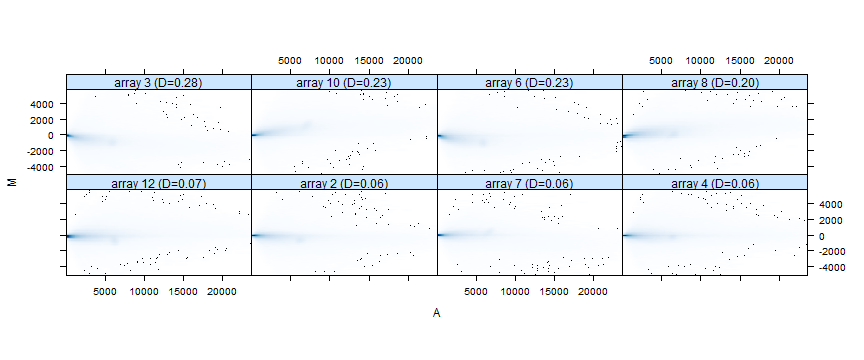
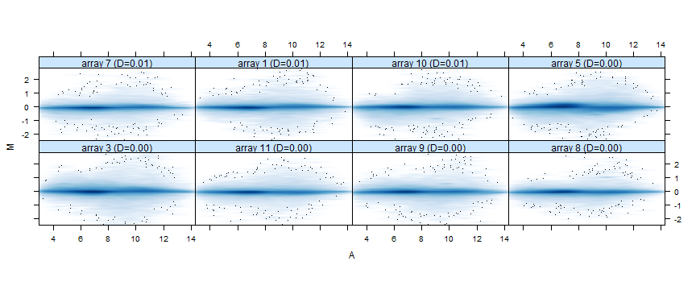
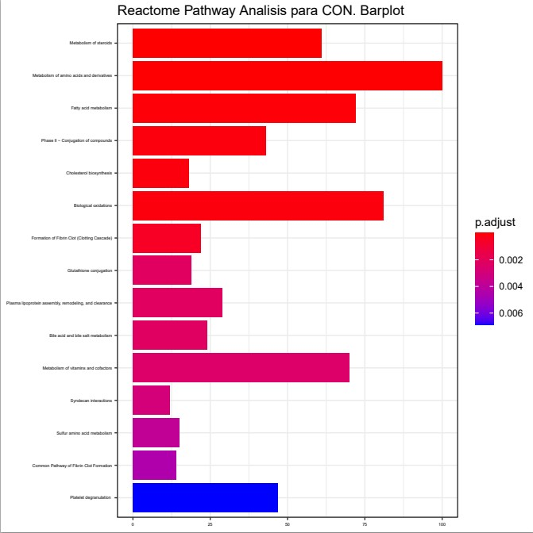
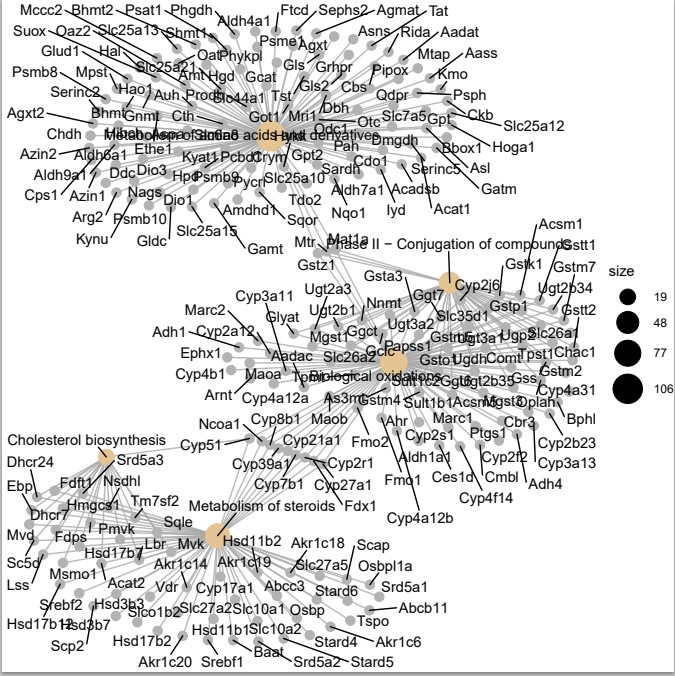
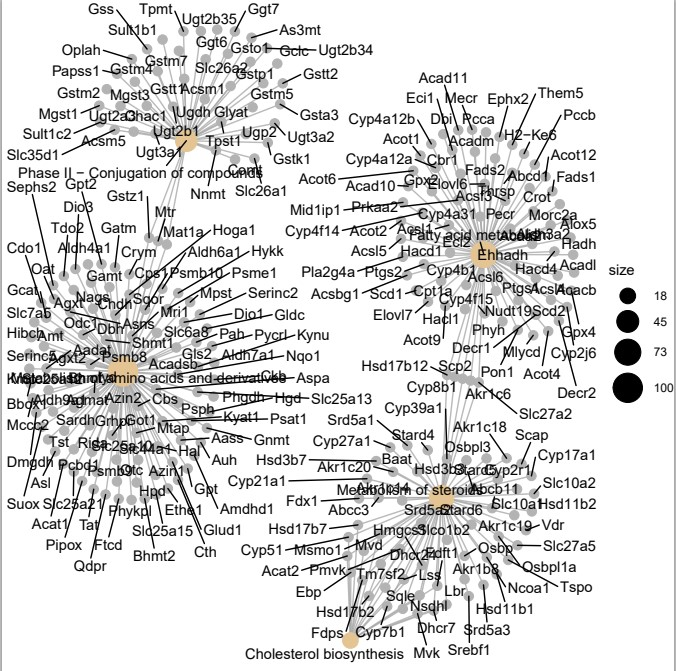

```{r setup, include=FALSE}
library(knitr)
knitr::opts_chunk$set(echo = TRUE, message = FALSE, warning = FALSE, 
                      comment = NA, prompt = TRUE, tidy = FALSE, 
                      fig.width = 7, fig.height = 7, fig_caption = FALSE,
                      cache=FALSE)
Sys.setlocale("LC_TIME", "C")
```

```{r echo=FALSE}
if(!(require(printr))) {
  install.packages(
    'printr',
    type = 'source',
    repos = c('http://yihui.name/xran', 'http://cran.rstudio.com')
  )
}
```

**INDICE DE CONTENIDOS**

1.[Abstract](#id1)
2.[Objetivo del estudio y datos](#id2)
2.1.[Objetivos del estudio](#id3)
2.2.[Obtención de las muestras](#id4)
2.3. [Análisis de microarrays](#id5)
3.[Métodos](#id6)
3.1.[Preparación del entorno de trabajo](#id7)
3.2.[Preparación de los datos para el análisis](#id8)
3.3.[Instalación de paquetes en R](#id9)
3.4.[Lectura de los archivos .CEL](#id10)
3.5.[Control de calidad de los datos sin procesar](#id11)
3.6.[Control de calidad de los datos procesados](#id12)
3.7.[Análisis de batch](#id13)
3.8.[Detección de los genes más variables](#id14)
3.9.[Filtrado de genes](#id15)
3.10.[Guardado de los datos normalizados y filtrados](#id16)
3.11.[Definición de la matriz de diseño](#id17)
3.12.[Definición de la matriz de contrastes](#id18)
3.13.[Estimación del modelo y selección de genes](#id19)
3.14.[Obtención de una lista de genes expresados diferencialmente](#id20)
3.15.[Anotación genética](#id21)
3.16.[Visualización de la expresión diferencial](#id22)
3.17.[Comparaciones múltiples](#id23)
3.18.[Heatmaps](#id24)
3.19.[Significación biológica de los resultados](#id25)
4.[Código R](#id26)
5.[Referencias](#id27)

El siguiente informe y sus datos se pueden consultar en https://github.com/dcc1978/Statistical-Analysis-of-Microarray-Data-PEC1/


<a name=id1></a>

# 1.Abstract

El factor de crecimiento transformante $\beta1$ ($TGF\beta1$) es una citocina implicada en el control y la diferenciación celular, la desregulación de la activación y de la ruta de señalización de ($TGF\beta1$) puede desencadednar apoptosis.Se ha demostrado que la CAV1 o caveolina-1, que es una proteina transmembrana, altera la señalización de ($TGF\beta1$).En el estudio se utilizaron hepatocitos estimulados con el factor de crecimiento en ratones normales y en ratones knock-out para caveolina.

# Palabras clave

Caveolina-1, factor de crecimiento transformante $\beta1$, metabolismo, enfermedades hepáticas, microarray

<a name=id2></a>

# 2.Objetivos del estudio y datos<a name="id2"></a>

<a name=id3></a>

## 2.1.Objetivos del estudio<a name="id3"></a>

El objetivo del estudio es evaluar si el papel de la caveolina-1 sobre afecta el control de los gene signature inducidos por el factor de crecimiento transformante $\beta1$, en consecuencia se pretende un mejor conocimiento de la función de ($TGF\beta1$) en hígado sano y en hígado enfermo, donde los niveles de CAV1 se encuentran implicados.

<a name=id4></a>

## 2.2. Obtención de las muestras

* Se utilizaron cuatro grupos de hepatocitos de ratón C57BL/6 de doce semanas de edad:
  + Grupo 1: cultivado con CAV1 y con $TGF\beta1$.
  + Grupo 2: cultivado con CAv1.
  + Grupo 3: cultivado con $TGF\beta1$.
  + Grupo 4: grupo control. 
  
<a name=id5></a>

## 2.3 Análisis de microarrays

Para analizar las diferencias de expresión génica con los diferentes tratamientos se utilizaron 12 arrays de Affymetrix MoGene 2.0, 3 para cada uno de los grupos mencionados en el apartado anterior. 
Los datos que hemos empleado en el estudio se encuentran disponibles en la bse de datos Gene Expresion Omnibus (GEO), perteneciente al NCBI y disponibles con el número de acceso GSE137339(https://www.ncbi.nlm.nih.gov/geo/download/?acc=GSE137339).

<a name=id6></a>

# 3. Métodos

<a name=id7></a>

## 3.1 Preparación del entorno de trabajo

Primeramente definiremos el directorio de trabajo, y crearemos tres carpetas: "data" donde almacenaremos los archivos .CEL descomprimidos y los archivos generados por nosotros target; una carpeta "results" donde registraremos los resultados obtenidos y finalmente la carpeta "figures" en la cual almacenaremos las figuras del estudio. 

```{r CreateFolders,warning=FALSE,eval=FALSE}
setwd(".")
dir.create("data")
dir.create("results")
dir.create("figures")
```

<a name=id8></a>

## 3.2 Preparación de los datos para el análisis

Los datos para el análisis constan de dos tipos de archivo, los archivos "CEL"(en nuestro caso 12 archivos .CEL que hemos descargado), y un archivo "targets.xlsx" que posteriormente convertimos a "targets.csv". Los archivos "CEL" son los datos sin procesar originados después de escanear y preprocesar el microarray con el software Affymetrix. Los archivos mencionados los almacenaremos en la carpeta "data". El archivo "targets" contiene la información sobre grupos y covariables, relaciona el nombre de cada archivo .CEL con su condición en el experimento. 


Para el análisis el archivo targets ha sido guardado con formato .csv, hemos creado el archivo a raíz de la información obtenida en (https://www.ncbi.nlm.nih.gov/geo/query/acc.cgi?acc=GSE137339). La tabla 1 muestra el contenido del archivo "targets" utilizado en el presente análisis:

```{r ReadTargets,echo=FALSE,fig.width= 3, fig.height=7, fig.align='center'}
targets <- read.csv2("./data/targets.csv", header = TRUE, sep = ";") 
knitr::kable(
  targets,booktabs=TRUE,
  caption=' Tabla1. Contenido del fichero targets utilizados para el análisis'
)
```

<a name=id9></a>

## 3.3 Instalación de paquetes en R

Los paquetes no disponibles en la instalación básica de R deben instalarse antes de proceder con el análisis. Los paquetes necesarios para realizar el estudio se pueden descargar de distintos repositorios, los más comunes serán CRAN para paquetes estándar o Bioconductor. Los paquetes r estándar se pueden descargar e instalar repositorios predeterminados de formulario con la función install.packages.  Los envases de bioconductor se pueden descargar e instalar con la función  biocLite() que en su momento se puede cargar en R con la fuente de instrucciones("https://bioconductor.org/biocLite.R").  
El siguiente código descargará e instalará los paquetes necesarios para el análisis. Éste código debe ejecutarse solo una vez. Las ejecuciones posteriores del análisis no necesitan volver a instalar los paquetes.
```{r , include=FALSE}

chooseCRANmirror(graphics=FALSE, ind=1)
install.packages("knitr")
install.packages("gplots")

if (!requireNamespace("BiocManager", quietly = TRUE))
    install.packages("BiocManager")

BiocManager::install("Biobase")
BiocManager::install("arrayQualityMetrics")
BiocManager::install("affy")
BiocManager::install("oligo")
BiocManager::install("oligoClasses")
BiocManager::install("pd.mogene.1.0.st.v1")
BiocManager::install("mogene10sttranscriptcluster.db")
BiocManager::install("genefilter")
BiocManager::install("limma")
BiocManager::install("GEOquery")
BiocManager::install("annotate")
BiocManager::install("AnnotationDbi")
BiocManager::install("org.Mm.eg.db")
BiocManager::install("ReactomePA")
BiocManager::install("reactome.db")
BiocManager::install("affycoretools")

```

```{r, include=FALSE}
library(knitr)
library(kableExtra)
library(Biobase)
library(arrayQualityMetrics)
library(affy)
library(Biobase)
library(BiocManager)
library(oligoClasses)
library(oligo)
library(pd.mogene.1.0.st.v1)
library(mogene10sttranscriptcluster.db)
library(genefilter)
library(limma)
library(GEOquery)
library(annotate)
library(AnnotationDbi)
library(gplots)
library(org.Mm.eg.db)
library(ReactomePA)
library(reactome.db)
```

<a name=id10></a>

## 3.4. Lectura de los archivos CEL

El siguiente paso es leer los datos sin procesar (archivos .CEL) y almacenar los datos en una variable (en este caso lo hemos llamado rawData). Primero tenemos que cargar el paquete  oligo con la biblioteca de funciones. En este paquete se codifican las funciones para leer los archivos CEL. 

```{r ReadCELfiles, echo=FALSE, message=FALSE, results='markup', warning=FALSE}
require(oligo)
celFiles <- list.celfiles("./data", full.names = TRUE)
require(Biobase)
my.targets <-read.AnnotatedDataFrame(file.path("./data","targets.csv"), 
                                     header = TRUE, row.names = 1, 
                                     sep=";") 
rawData <- read.celfiles(celFiles, phenoData = my.targets)
```

Para facilitar nuestro trabajo, cambiaremos el nombre largo por las abreviaturas asignadas (ShortName):

```{r ChangeName}
colnames(rawData) <-rownames(pData(rawData)) <- my.targets@data$ShortName
```

<a name=id11></a>

## 3.5.Control de calidad de los datos sin procesar

Empleamos la libreria "arrayQualityMetrics()" para realizar el control de calidad de los raw data. Comprobamos los resultados del análisis de calidad en una carpeta QCDIR.raw creada dntro de la carpeta de resultado creada anteriormente. Dentro de ésta carpeta buscaremos un archivo llamado index.html, que abre una página web desde donde podremos acceder a un resumen del análisis realizado. La figura 1 muestra el encabezado de éste archivo que contiene una tabla con tres columnas que indican algunos criterios de calidad que deben ser verificados. Se han marcado 5 muestras, generlamente si sólo hay una marca significa que los problemas potenciales que pueden acarrear son pequeños, por lo que podemos decidir mantener todas las muestras en el análisis. 

```{r QCRaw, message=FALSE, warning=FALSE, eval=FALSE}
require(arrayQualityMetrics)
arrayQualityMetrics(rawData, outdir = file.path("./results", "QCDir.Raw"), force=TRUE)
```

```{r QCRawDataRes, echo=FALSE,eval=TRUE, out.width="100%",fig.align="center", fig.cap="Figura1. Resumen del control de calidad de los datos crudos producido por arrayQualityMetrics()"}
knitr::include_graphics("figures/figura1.png")
```

Realizaremos otro análisis de calidad, el análisis de componentes principales (PCA Analysis) y generando su gráfica, la cual podemos apreciar en la figura 2. 

```{r PCAanalysis raw,echo=FALSE, eval=TRUE}
library(ggplot2)
library(ggrepel)
plotPCA3 <- function (datos, labels, factor, title, scale,colores, size = 1.5, glineas = 0.25) {
  data <- prcomp(t(datos),scale=scale)
  # plot adjustments
  dataDf <- data.frame(data$x)
  Group <- factor
  loads <- round(data$sdev^2/sum(data$sdev^2)*100,1)
  # main plot
  p1 <- ggplot(dataDf,aes(x=PC1, y=PC2)) +
    theme_classic() +
    geom_hline(yintercept = 0, color = "gray70") +
    geom_vline(xintercept = 0, color = "gray70") +
    geom_point(aes(color = Group), alpha = 0.55, size = 3) +
    coord_cartesian(xlim = c(min(data$x[,1])-5,max(data$x[,1])+5)) +
    scale_fill_discrete(name = "Group")
  # avoiding labels superposition
  p1 + geom_text_repel(aes(y = PC2 + 0.25, label = labels),segment.size = 0.25, size = size) + 
    labs(x = c(paste("PC1",loads[1],"%")),y=c(paste("PC2",loads[2],"%"))) +  
    ggtitle(paste("Principal Component Analysis for: ",title,sep=" "))+ 
    theme(plot.title = element_text(hjust = 0.5)) +
    scale_color_manual(values=colores)
  }
```


```{r PCARaw, echo=FALSE,eval=TRUE, fig.align="center", fig.cap="Figura 2.Visualización de los componentes principales de los datos sin procesar"}
plotPCA3(exprs(rawData), labels = targets$ShortName, factor = targets$Group, 
         title="Raw data", scale = FALSE, size = 3, 
         colores = c("red", "blue", "green", "yellow"))
```

El primer componente del PCA abarca un total del 49.3% de la variabilidad de las muestras,y el segundo abarca un 25.2%. Podemos deducir que la variabilidad está condicionada al tipo de tratamiento, ya que en el análisis se observa claramente como los grupos se diferencian al estar tratados con el factor de crecimiento o sin él.  

```{r savePCAraw, echo=FALSE, eval=TRUE, results='hide'}
tiff("figures/PCA_RawData.tiff", res = 200, width = 4.5, height = 4, units = 'in')
plotPCA3(exprs(rawData), labels = targets$ShortName, factor = targets$Group, 
         title="Raw data", scale = FALSE, size = 2, 
         colores = c("red", "blue", "green", "yellow"))
dev.off()
```

Realizamos una figura de la distribuión de las intensidades mediante un "boxplot"en la figura 3, donde observamos una ligera variación de las intensidades entre arrays, pero es lo esperado para los datos sin procesar. Cada color representa a un grupo de datos. 

```{r BoxplotRaw, message=FALSE,eval=TRUE, echo=FALSE, fig.align="center", fig.cap="Figura 3.Boxplot de los datos sin procesar"}
boxplot(rawData, cex.axis=0.5, las=2,  which="all", 
         col = c(rep("red", 3), rep("blue", 3), rep("green", 3), rep("yellow", 3)),
         main="Distribucion de la intensidad de los raw data")
```

```{r saveIntensRaw, echo=FALSE, eval=TRUE,results='hide'}
tiff("figures/Intensity_RawData.tiff", res = 200, width = 4, height = 4, units = 'in')
boxplot(rawData, cex.axis=0.5, las=2,  which="all", 
         col = c(rep("red", 3), rep("blue", 3), rep("green", 3), rep("yellow", 3)),
         main="Distribution de la intensidad de los datos sin procesar")
dev.off()
```

<a name=id12></a>

## 3.6. Control de calidad de los datos procesados

Antes de emprender el análisis de la expresión diferencial, necesitamos optimizar los arrays y que sean comparables entre ellos, reduciendo y si es posible eliminando, toda la variabilidad de las muestras que no son debidas a razones biológicas. Queremos pues, asegurarnos que las diferencias son debidas a la expresión diferencial de los genes y no a sesgos artificiales debidos a problemas técnicos. 

```{r Normalization, include=FALSE}
eset_rma<-oligo::rma(rawData)
eset_rma
write.csv2(exprs(eset_rma), file="./results/normalized.Data.csv")
```

Volvemos a realizar un control de los datos normalizados para compararlos con los rawdata

```{r QCNorm,message=FALSE,warning=FALSE,evaL=FALSE}

library(arrayQualityMetrics)
arrayQualityMetrics(eset_rma,outdir=file.path("./results/QCDir.Norm"),force=TRUE)

```

Los resultados obtenidos de arrayQualityMetrics nos muestrasn una notable mejora de los indicadores

```{r control de calidad de datos normalizados resultados,eval=TRUE, echo=FALSE, out.width="100%", fig.align="center", fig.cap="Figura4. Resumen de resultados del control de calidad para de los datos normalizados"}
knitr::include_graphics("figures/figura4.png")
```
La figura 4 muestra el mismo resumen que el mostrado anteriormente, pero se realiza con datos normalizados. Obsérvese que ya no hay ninguna columna marcada.

Realizamos un gráfico del análisis de los componentes principales realizados en datos normalizados:

```{r PCANorm, echo=FALSE,eval=TRUE, fig.align="center", fig.cap="Figura 5.Visualización de los componentes principales de los datos normalizados"}
plotPCA3(exprs(eset_rma), label = targets$ShortName, factor = targets$Group, 
         title="Datos normalizados", scale = FALSE, size = 2 , 
         colores = c("red", "blue","green","yellow"))
```
En la figura 5 vemos que  el primer componente representa el 57.5% de la variabilidad total, el porcentaje de variabilidad explicada ha aumentado con respecto al análisis anterior en datos sin procesar. Del mismo modo que con el PCA con datos sin procesar, separa las muestra de la condición sin TGFB1 a la derecha y las muestras tratadas con TGFB1 a la izquierda. 

Volvemos a diseñar un boxplot pero esta vez con los datos normalizados  para contrastarlos con el boxplot anterior. 

```{r BoxplotNorm, message=FALSE, fig.align="center", echo=FALSE, fig.cap="Figura 6. Boxplot de los datos normalizados"}

boxplotnormalizado <- boxplot(eset_rma, cex.axis=0.5, las=2,  which="all", 
         col = c(rep("red",3), rep("blue",3), rep("green",3), rep("yellow",3)),
         main="Boxplot for arrays intensity: Normalized Data")
```

En la figura 6 se observa una gráfica boxplot que representa la distribución de las intensidades normalizadas a lo largo de todas las muestras con los datos normalizados, sugiere que la normalización ha funcionado correctamente. 

Como una siguiente observación al análisis de normalización, haremos una comparativa de los gráficos "MA-plot", haciendo una comparativa de los gráficos que corresponden a las muestras sin procesar (figura  7) y a las muestras normalizadas (figura 8). Observamos que los datos se centran a lo largo del eje M=0, que es lo que esperabamos.

```{r control de calidad de datos MAplot raw, echo=FALSE, out.width="100%", fig.align="center", fig.cap="Figura 7.MA plot de los datos sin procesar"}

```

```{r control de calidad de datos MAnorm, echo=FALSE, out.width="100%", fig.align="center", fig.cap="Figura 8.MA plot de los datos normalizados"}

```

<a name=id13></a>

## 3.7. Análisis de batch

Los resultados de los microarrays de expresión génica pueden verse afectados por diferencias minúsculas en cualquier número de variables no biológicas como reactivos de diferentes lotes, la manipulación de técnicos diferentes y la más habitual que es la diferente fecha de procesamiento de las muestras del mismo experimento. El error acumulativo introducido por éstas variaciones experimentales se conoce como "efectos por lotes" o "batch effect". Se han desarrolado diferentes enfoques para identificar y eliminar los efectos por lostes de los datos de microarrays,utilizaremos el análisis PVCA (análisis de variación principal):

```{r BatchDetection, message=FALSE, warning=FALSE, echo=FALSE}
#load the library
require(pvca)
pData(eset_rma) <- targets
#select the threshold
pct_threshold <- 0.6
#select the factors to analyze
batch.factors <- c("Treatment", "Group")
#run the analysis
pvcaObj<-pvcaBatchAssess(eset_rma,batch.factors,pct_threshold)
```

```{r, echo=FALSE, fig.align="center", fig.cap="Figura 9.Estimación PVCA"}
bp <- barplot(pvcaObj$dat, xlab = "Efectos",
 ylab = "Variación de la proporción media ponderada",
 ylim= c(0,1.1),col = c("mediumorchid"), las=2,
 main="Estimación PVCA")
axis(1, at = bp, labels = pvcaObj$label, cex.axis = 0.75, las=2)
values = pvcaObj$dat
new_values = round(values , 3)
text(bp,pvcaObj$dat,labels = new_values, pos=3, cex = 0.7)
```

Los resultados de la figura 9 muestran que la principal variación es debida al tratamiento al cual están sometidas las muestras, es un factor experimental incorporado en el análisis, por lo tanto se espera que suponga una variación significativa. Podemos descartar pues fuentes de variación debidas a aspectos metodológicos del experimento. 

<a name=id14></a>

## 3.8. Detección de los genes más variables

La selección diferencial de genes expresados se ve afectada por el número de genes a analizar. Cuanto mayor sea el número mayor será el ajuste necesario de los p valores. Si un gen se expresa diferencialmente, se espera que haya una cierta diferencia entre grupos, por lo tanto la varianza global del gen será mayor que la de aquellos que no tienen expresión diferencial. Trazar la variabilidad general de todos los genes es útil para decidir qué porcentaje de genes muestran una variabilidad que puede atribuirse a otras causas que no sean la variabilidad aleatoria. En la figura 10 se representan las desviaciones estándar de todos los genes ordenados de más pequeño a más grande, la gráfica muestra que los genes más variables son aquellos con una desviación estándar por encima del 90-95%:

```{r SDplot,echo=FALSE, fig.align="center", fig.cap="Figura 10. Valores de las desviaciones estándar de las muestras de los genes ordenados de menor a mayor"}
sds <- apply (exprs(eset_rma), 1, sd)
sdsO<- sort(sds)
plot(1:length(sdsO), sdsO, main="Distribución de la variabilidad de todos los genes",
     sub="Las lineas verticales representan los percentiles 90% y 95%",
     xlab="Índice de genes (del menor al mayor variable)", ylab="Desviación estándar")
abline(v=length(sds)*c(0.9,0.95))
```

<a name=id15></a>

## 3.9. Filtrado de genes

Pretendemos filtrar aquellos genes cuya variabilidad puede atribuirse a una variación aleatoria, es decir, aquellos genes que, razonablemente no se espera que se expresen diferencialmente. La función nsFilter del paquete bioconductor se puede utilizar para eliminar genes basados en un umbral de variabilidad. Mostramos la cantidad de genes que han sido filtrados:

```{r Filtering1, results='hide', message=FALSE,echo=FALSE}
require(genefilter)
require(mogene10sttranscriptcluster.db)
annotation(eset_rma) <- "mogene10sttranscriptcluster.db"
filtered <- nsFilter(eset_rma, 
                     require.entrez = TRUE, remove.dupEntrez = TRUE,
                     var.filter=TRUE, var.func=IQR, var.cutoff=0.75, 
                     filterByQuantile=TRUE, feature.exclude = "^AFFX")
```


```{r FilterResults1, results='hide', echo=FALSE}
names(filtered)
class(filtered$eset)
```

```{r FilterResults2,echo=FALSE,eval=TRUE}
print(filtered$filter.log)
eset_filtered <-filtered$eset
```

<a name=id16></a>

## 3.10. Guardado de los datos normalizados y filtrados

```{r SaveData1, results='hide', message=FALSE}
write.csv(exprs(eset_rma), file="./results/normalized.Data.csv")
write.csv(exprs(eset_filtered), file="./results/normalized.Filtered.Data.csv")
save(eset_rma, eset_filtered, file="./results/normalized.Data.Rda")
```
La función nsFilter devuelve los valores filtrados y un informe de los resultados del filtrado. Los datos filtrados son el punto de partida para análisis posteriores, pero es posible que deseemos volver a ellos, por ejemplo para revisar valores específicos de expresión génica. 

<a name=id17></a>

## 3.11. Definición de la matriz de diseño

La selección de genes diferenciales expresados consiste en hacer alguna prueba, generalmente de carácter genético para comprobar la expresión entre grupos. El protocolo que utilizaremos será el método de los modelos lineales para microarrays, implementado en el paquete de limma para seleccionar genes expresados de forma diferencial.

El primer paso para el análisis basado en modelos lineales es crear la matriz de diseño, básicamente es una matriz que descirbe la asignación de cada muestra a un grupo o condición experimenta. Tiene tantas filas cmo muestras y tantas columnas como grupos. La matriz de diseño se puede definir de manera manueal oa a aprtir de una variable de factor que puede haber sido introducida en el archivo "targets". En nuestro estudio, la variable "Grupo" es una combinación de las condiciones experimentales "Caveolina/TGFB" y "Control/TGFB", que representaremos conjuntamente como un factor con cuatro niveles:

```{r DesignMatrix, message=FALSE,echo=FALSE,eval=TRUE}
library(limma)
designMat<- model.matrix(~0+Group, pData(eset_filtered))
colnames(designMat) <- c("Cav.TGFB1", "Cav.Ctrl", "Con.TGFB1", "Con.Ctrl")
print(designMat)
```

Definiremos la matriz de contraste escribiendo las comparaciones entre grupos, la matriz debe constar de tantas columnas como comparaciones -tres en nuestro comparaciones en nuestro caso- y tantas filas como grupos -cuatro en nuestro caso-.Las comparaciones a realizar se basan en :
1. Caso CAV:si existen diferencias entre los hepatocitos caveolina/TGFB y caveolina/no TGFB.
2. Caso CON: el segundo caso si hay diferencias entre los hepatocitos control/TGFB1 y control/no TGFB1.
3. Caso INT: en el tercer caso una comparación entre el caso CAV y el caso CON.

<a name=id18></a>

## 3.12. Definición de la matriz de contrastes

La matriz de contrastes se utiliza para describir las comparaciones entre gurpos. Se compone de tantas columnas como comparaciones y tantas filas como grupos. Una comparación entre grupos -llamado "contraste"- se representa mediante un "1" y un "-1" en las filas de grupos para comparar y ceros en el resto. Si varios grupos intervinieran en la comparación tendrían tantos coeficientes como grupos con la única restricción de que su suma sería cero. 
```{r setContrasts,echo=FALSE,eval=TRUE}

cont.matrix <- makeContrasts (CAV = Cav.TGFB1-Cav.Ctrl,
                              CON = Con.TGFB1-Con.Ctrl,
                              INT = (Cav.TGFB1-Cav.Ctrl) - (Con.TGFB1-Con.Ctrl),
                              levels=designMat)
print(cont.matrix)
```

<a name=id19></a>

## 3.13. Estimación del modelo y selección de genes

Una vez definida la matriz de diseño y los contrastes, procederemos a estimar el modelo, estimar los contrastes y realizar las purebas de significación que conducirán a la decisión, para cada gen y cada comparación, si pueden considerarse diferencialmente expresados. 
```{r, linearmodelfit,echo=FALSE,eval=TRUE}
require(limma)
fit<-lmFit(eset_filtered, designMat)
fit.main<-contrasts.fit(fit, cont.matrix)
fit.main<-eBayes(fit.main)
class(fit.main)
results<-decideTests(fit.main)

class(fit.main)
```

<a name=id20></a>

## 3.14. Obtención de una lista de genes expresados diferencialmente

La función topTable() contiene, para un contraste dado, una lista de genes ordenados desde aquel con el valor p más pequeño hasta el más grande, que podemos considerar de menos a más difrencialmente expresado. Procederemos con las tres comparaciones:

Comparación 1: Genes que cambian su expresión dentro del grupo con caveolina si son tratados o no con TGFB
```{r, topTabs1,echo=FALSE,eval=TRUE}
topTab_CAV<- topTable (fit.main, number=nrow(fit.main), coef="CAV", adjust="fdr") 
head(topTab_CAV)
```
Comparación 2: Genes que cambian su expresión dentro del grupo sin caveolina si son tratados o no con TGFB
```{r, topTabs2,echo=FALSE,eval=TRUE}
topTab_CON <- topTable (fit.main, number=nrow(fit.main), coef="CON", adjust="fdr") 
head(topTab_CON)
```
Comparación 3 Genes que se comportan de manera diferente entre la comparación 1 y 2:
```{r, topTabs3,echo=FALSE,eval=TRUE}
topTab_INT  <- topTable (fit.main, number=nrow(fit.main), coef="INT", adjust="fdr") 
head(topTab_INT)
```

La primera columna de cada topTable contiene el ID de Affymetrix para cada conjunto de sondeos. El siguiente procedimiento será determinar qué gen corresponde a cada ID de Affymetrix, proceso que conocemos como anotacion

<a name=id21></a>

## 3.15. Anotación genética

A partir de las tablas anteriores incorporaremos información complementaria extraída de los paquetes de anotaciones, de esta manera los resultados serán más comprensibles y fáciles de interpretar. 

```{r GeneAnnotation, message=FALSE, warning=FALSE,echo=FALSE,eval=TRUE}
annotatedTopTable <- function(topTab, anotPackage)
{
  topTab <- cbind(PROBEID=rownames(topTab), topTab)
  myProbes <- rownames(topTab)
  thePackage <- eval(parse(text = anotPackage))
  geneAnots <- select(thePackage, myProbes, c("SYMBOL", "ENTREZID", "GENENAME"))
  annotatedTopTab<- merge(x=geneAnots, y=topTab, by.x="PROBEID", by.y="PROBEID")
return(annotatedTopTab)
}
```

```{r annotateTopTables}
topAnnotated_CAV <- annotatedTopTable(topTab_CAV,
anotPackage="mogene10sttranscriptcluster.db")
topAnnotated_CON <- annotatedTopTable(topTab_CON,
anotPackage="mogene10sttranscriptcluster.db")
topAnnotated_INT <- annotatedTopTable(topTab_INT,
anotPackage="mogene10sttranscriptcluster.db")
write.csv(topAnnotated_CAV, file="./results/topAnnotated_CAV.csv")
write.csv(topAnnotated_CON, file="./results/topAnnotated_CON.csv")
write.csv(topAnnotated_INT, file="./results/topAnnotated_INT.csv")
```

<a name=id22></a>

## 3.16. Visualización de la expresión diferencial

Un buen recurso para visualizar la expresión diferencial es el Volcanoplot.Éste gráfico mustra si hay muchos o pocos genes que se expresan de manera significativa o si éste número es bajo. En el eje de las X se representan los cambios de expresión a escala logarítmica (efecto biológico) y en el eje Y el -log del p-valor. 

En el primer Volcano plot compararemos los hepatocitos cav incubados con $TGF\beta1$ y sin $TGF\beta1$.

```{r volcanoPlot,echo=FALSE,eval=TRUE, fig.cap="Figura 11.Volcano plot para la comparación entre hepatocitos cav incubados con TGFbeta1 y sin TGFbeta1"}
require(mogene10sttranscriptcluster.db)
geneSymbols <- select(mogene10sttranscriptcluster.db, rownames(fit.main), c("SYMBOL"))
SYMBOLS<- geneSymbols$SYMBOL
volcanoplot(fit.main, coef=1, highlight=4, names=SYMBOLS, 
            main=paste("Genes expresados diferencialmente", colnames(cont.matrix)[1], sep="\n"))
  abline(v=c(-1,1))
```
En el volcano plot mostrado enla figura 11 representa la comparación de los hepatocitos incubados con TGFbeta1 y sin TGFbeta 1 se observan genes downregulados(parte izquierda del volcanoplot), en los que destaca Tmeff1 y Olfm2. Como genes upregulados tenemos Akr1c20.

```{r volcanoPlot2, echo=FALSE,eval=TRUE,fig.cap="Figura 12.Volcano plot para la comparación entre hepatocitos CON incubados con TGFbeta1 y sin TGFbeta1"}
require(mogene10sttranscriptcluster.db)
geneSymbols <- select(mogene10sttranscriptcluster.db, rownames(fit.main), c("SYMBOL"))
SYMBOLS<- geneSymbols$SYMBOL
volcanoplot(fit.main, coef=2, highlight=4, names=SYMBOLS, 
            main=paste("Genes expresados diferencialmente", colnames(cont.matrix)[2], sep="\n"))
  abline(v=c(-1,1))
```
En la figura 12, el volcano plot para la comparación entre hepatocitos control incubados con el factor de crecimiento y sin, se destaca un gen downregulado más que en el caso anterior (Fermt1).


```{r volcanoPlot3,echo=FALSE,eval=TRUE,fig.cap="Figura 13.Volcano plot para la comparación entre hepatocitos CAV Y CON."}
require(mogene10sttranscriptcluster.db)
geneSymbols <- select(mogene10sttranscriptcluster.db, rownames(fit.main), c("SYMBOL"))
SYMBOLS<- geneSymbols$SYMBOL
volcanoplot(fit.main, coef=3, highlight=4, names=SYMBOLS, 
            main=paste("Genes expresados diferencialmente", colnames(cont.matrix)[3], sep="\n"))
  abline(v=c(-1,1))
```
En la figura 13, el volcano plot donde se comparan los dos grupos hay dos genes a destacar que estan downregulados: "Voan" y "Tnc".

<a name=id23></a>

## 3.17. Comparaciones múltiples

Cuando realizamos varias comparaciones a la vez puede resultar importante ver qué genes cambian simultánemente en más de una comparación.Si el número de comparaciones es alto, tmabién puede ser necesario realizar un ajuste de p-valores entre las comparaciones, distinto del realizado entre genes. Las funciones decidetests y VennDiagram del paquete limma permiten realizar éstas comparaciones. 

```{r decideTests.1,echo=FALSE,eval=TRUE}
require(limma)
res<-decideTests(fit.main, method="separate", adjust.method="fdr", p.value=0.1, lfc=1)
```

```{r resumeDecideTests,echo=FALSE,eval=TRUE}
sum.res.rows<-apply(abs(res),1,sum)
res.selected<-res[sum.res.rows!=0,] 
print(summary(res))
```

Diagrama de Venn

```{r, vennDiagram, fig.cap="Figura 14.Diagrama de Venn donde se muestran los genes en comun entre las tres comparaciones"}
vennDiagram (res.selected[,1:3], cex=0.9)
title("Genes in common between the three comparisons\n Genes selected with FDR < 0.1 and logFC > 1")
```

<a name=id24></a>

## 3.18. Heatmaps

Los genes que se han seleccionado como diferenciales expresados se pueden visualizar mediante un mapa de calor. Estas gráficas utilizan paletas de colores para resaltar valores distintos –aquí expresiones positivas (up-regulated) o negativas (down-regulated) diferenciadas significativamente. 

```{r data4Heatmap, echo=FALSE,eval=TRUE, fig.align="center"}
probesInHeatmap <- rownames(res.selected)
HMdata <- exprs(eset_filtered)[rownames(exprs(eset_filtered)) %in% probesInHeatmap,]
geneSymbols <- select(mogene10sttranscriptcluster.db, rownames(HMdata), c("SYMBOL"))
SYMBOLS<- geneSymbols$SYMBOL
rownames(HMdata) <- SYMBOLS
write.csv(HMdata, file = file.path("./results/heatmap.csv"))
```

```{r heatmapNoclustering, echo=FALSE, eval=TRUE,fig.align="center", fig.cap= "Figura 15.Heatmap de expresión sin agrupación"}
my_palette <- colorRampPalette(c("blue", "red"))(n=299)
require(gplots)
heatmap.2(HMdata,
Rowv = FALSE,
Colv = FALSE,
main = "Genes diferencialmente expresados \n FDR < 0,1, logFC >=1",
scale = "row",
col = my_palette,
sepcolor = "white",
sepwidth = c(0.05,0.05),
cexRow = 0.5,
cexCol = 0.9,
key = TRUE,
keysize = 1.5,
density.info = "histogram",
ColSideColors = c(rep("red",3),rep("blue",3), rep("green",3), rep("yellow",3)),
tracecol = NULL,
dendrogram = "none",
srtCol = 30)
```

```{r heatmapClustering,echo=FALSE,eval=TRUE, fig.align="center", fig.cap= "Figura 16.Heatmap de expresión agrupando genes (filas y muestras (columnas) por similaridad"}
heatmap.2(HMdata,
Rowv = TRUE,
Colv = TRUE,
dendrogram = "both",
main = "Differentially expressed genes \n FDR < 0,1, logFC >=1",
scale = "row",
col = my_palette,
sepcolor = "white",
sepwidth = c(0.05,0.05),
cexRow = 0.5,
cexCol = 0.9,
key = TRUE,
keysize = 1.5,
density.info = "histogram",
ColSideColors = c(rep("red",3),rep("blue",3), rep("green",3), rep("yellow",3)),
tracecol = NULL,
srtCol = 30)
```

```{r, echo=FALSE,eval=TRUE, results='hide'}
tiff("figures/Heatmap1.tiff", res = 150, width = 5.5, height = 5.5, units = 'in')
heatmap.2(HMdata,
Rowv = TRUE,
Colv = TRUE,
main = "Differentially expressed genes \n FDR < 0,1, logFC >=1",
scale = "row",
col = my_palette,
sepcolor = "white",
sepwidth = c(0.05,0.05),
cexRow = 0.5,
cexCol = 0.9,
key = TRUE,
keysize = 1.5,
density.info = "histogram",
ColSideColors = c(rep("red",3),rep("blue",3), rep("green",3), rep("yellow",3)),
tracecol = NULL,
dendrogram = "both",
srtCol = 30)
dev.off()
tiff("figures/Heatmap2.tiff", res = 150, width = 5.5, height = 5.5, units = 'in')
heatmap.2(HMdata,
Rowv = FALSE,
Colv = FALSE,
dendrogram = "none",
main = "Differentially expressed genes \n FDR < 0,1, logFC >=1",
scale = "row",
col = my_palette,
sepcolor = "white",
sepwidth = c(0.05,0.05),
cexRow = 0.5,
cexCol = 0.9,
key = TRUE,
keysize = 1.5,
density.info = "histogram",
ColSideColors = c(rep("red",3),rep("blue",3), rep("green",3), rep("yellow",3)),
tracecol = NULL,
srtCol = 30)
dev.off()
```

<a name=id25></a>

## 3.19. Significación biológica de los resultados

Una vez obtenida una lista de genes que caracteriza la diferencia entre dos condiciones, debemos darle una interpretación. Determinaremos si, dada una lista de genes seleccionados con una expresión diferenciada las funciones, procesos biológicos o vías moleculares que los caracterizan aparecen en ésta lista con más frecuencia que el resto de genes analizados. Utilizaremos  el análisis básico de enriquecimiento  del paquete ReactomePA. 

Los análisis de éste tipo necesitan un número mínimo de genes para ser fiables, preferiblemente unos pocos cientos que unas pocas docenas, por lo que es común realizar una selección menos restrictiva que con los pasos anteriores. Por ejemplo, una opcción es incluir todos los genes con un límite FDR no estricto, como FDR<0.15:


```{r selectGenes,echo=FALSE,eval=TRUE}
listOfTables <- list(CAV = topTab_CAV, 
                     CON = topTab_CON, 
                     INT = topTab_INT)
listOfSelected <- list()
for (i in 1:length(listOfTables)){
  # select the toptable
  topTab <- listOfTables[[i]]
  # select the genes to be included in the analysis
  whichGenes<-topTab["adj.P.Val"]<0.15
  selectedIDs <- rownames(topTab)[whichGenes]
  # convert the ID to Entrez
  EntrezIDs<- select(mogene10sttranscriptcluster.db, selectedIDs, c("ENTREZID"))
  EntrezIDs <- EntrezIDs$ENTREZID
  listOfSelected[[i]] <- EntrezIDs
  names(listOfSelected)[i] <- names(listOfTables)[i]
}
sapply(listOfSelected, length)
```

Podemos observar que se han seleccionado 4527 genes para los hepatocitos con caveolina, 4352 genes para los hepatocitos cultivados sin caveolina y 90 genes para el caso de la comparativa entre grupos. 


El análisis también requiere que se analicen los identificadores para todos los genes disponibles:
```{r identificadores}
mapped_genes2GO <- mappedkeys(org.Mm.egGO)
mapped_genes2KEGG <- mappedkeys(org.Mm.egPATH)
mapped_genes <- union(mapped_genes2GO , mapped_genes2KEGG)
```
Realizaremos el análisis de comparación biológica para las comparaciones CAV (hepatocitos con caveolina cultivados con y sin el factor de crecimiento), y CON (hepatocitos sin caveolina cultivados con y sin el factor de crecimiento)
```{r BiologicalSig,echo=FALSE,eval=TRUE}
library(ReactomePA)
listOfData <- listOfSelected[1:2]
comparisonsNames <- names(listOfData)
universe <- mapped_genes
for (i in 1:length(listOfData)){
  genesIn <- listOfData[[i]]
  comparison <- comparisonsNames[i]
  enrich.result <- enrichPathway(gene = genesIn,
                                 pvalueCutoff = 0.05,
                                 readable = T,
                                 pAdjustMethod = "BH",
                                 organism = "mouse",
                                 universe = universe)
  
  cat("##################################")
  cat("\nComparison: ", comparison,"\n")
  print(head(enrich.result))
  if (length(rownames(enrich.result@result)) != 0) {
  write.csv(as.data.frame(enrich.result), 
             file =paste0("./results/","ReactomePA.Results.",comparison,".csv"), 
             row.names = FALSE)
  
  pdf(file=paste0("./results/","ReactomePABarplot.",comparison,".pdf"))
    print(barplot(enrich.result, showCategory = 15, font.size = 4, 
            title = paste0("Reactome Pathway Analisis para ", comparison,". Barplot")))
  dev.off()
  
  pdf(file = paste0("./results/","ReactomePAcnetplot.",comparison,".pdf"))
    print(cnetplot(enrich.result, categorySize = "geneNum", schowCategory = 15, 
         vertex.label.cex = 0.75))
  dev.off()
  }
}
```

Confeccionaremos dos barplot en los que nos permitirán determinar los grupos de genes agrupados por su rol metabólico y su valor de ajuste p, para ambos grupos. En la figura 17 para los hepatocitos con caveoina y en la figura 18 para los hepatocitos sin caveolina. 

```{r BarplotCAV, echo=FALSE,eval=TRUE, fig.align="center",out.width="75%%", fig.cap="Figura 17.Barplot de los hepatocitos con caveolina"}
knitr::include_graphics("figures/BArplotCAV.PNG.jpg")
```

```{r BarplotCON, echo=FALSE,eval=TRUE, fig.align="center", out.width="75%%",fig.cap="Figura 18.Barplot de expresión génica de los hepatocitos sin caveolina"}

```

Observamos que hay elementos comunes entre ambas comparaciones, como por ejemplo la implicación en el metabolismo de los aminoácidos y sus derivados. 

Las figuras 19 y 20 nos muestran los CNEplot de ambos grupos:

```{r CNETplotCAV, echo=FALSE,eval=TRUE, fig.align="center",out.width="75%", fig.cap="Figura 19.CNETplot de los hepatocitos con caveolina"}

```

```{r CNETplotCON, echo=FALSE,eval=TRUE, fig.align="center",out.width="75%", fig.cap="Figura 20.CNETplot de expresión génica de los hepatocitos sin caveolina"}

```

```{r summary, echo=FALSE, fig.cap="Figura 21. Red de los 20 términos GO más relevantes para CAV", fig.align="center"}
library(enrichplot)
emapplot(enrich.result,pie="count", pie_scale=1.5, layout="nicely",color = "p.adjust",showCategory = 20)
png(filename = "./figures/enrichplotCAV.png")
```

En la figura 21 visualizamos el análisis de enriquecimiento visto de una manera diferente, mediante un heatplot el cual es parecido a un cnetplot pero mucho más visual, se muestran las 20  vias más relevantes de Gene Ontology. 

En las dos tablas siguientes se muestran las vias más relevantes para las comparaciones CAV y CON, mostramos las primeras 5 lineas: 
```{r summary2, echo=FALSE}
Tab.react1 <- read.csv2(file.path("./results/ReactomePA.Results.CAV.csv"),
sep = ",", header = TRUE, row.names = 1)
Tab.react1 <- Tab.react1[1:5, 1:5]
knitr::kable(Tab.react1, booktabs = TRUE, caption = "Primeras filas y columnas para la comparacion CAV")
```


```{r summary3, echo=FALSE}
Tab.react2 <- read.csv2(file.path("./results/ReactomePA.Results.CON.csv"),
sep = ",", header = TRUE, row.names = 1)
Tab.react2 <- Tab.react2[1:5, 1:5]
knitr::kable(Tab.react2, booktabs = TRUE, caption = "Primeras filas y columnas para la comparacion CON")
```

<a name=id26></a>

# 4. Código R

Debido a la extensión del código no se ha mostrado en su totalidad en el archivo en pdf, está recopilado íntegramente como apéndice en el archivo rcode.txt en la carpeta results y además está disponible en su totalidad en el archivo  cartoixa_david_ADO_PEC1.rmd.


<a name=id27></a>

# 5. Referencias

Ricardo Gonzalo, Sanchez-Pla A. Statistical analysis of microarray data 2019. https://github.com/ASPteaching/Omics_Data_Analysis-Case_Study_1-Microarrays

Mei Han, Zeribe Chike Nwosu, Weronika Pooronska, Matthias Philip Ebert, Steven Dooley, Christoph Meyer. Caveolin-1 Impacts on TGFBetha Regulation of Metabolic Gene Signatures in Hepatocytes. Front Physiol. 2020 Jan 21;10:1606.doi:10.3389/fphys.2019.01606.eCollection 2019.


